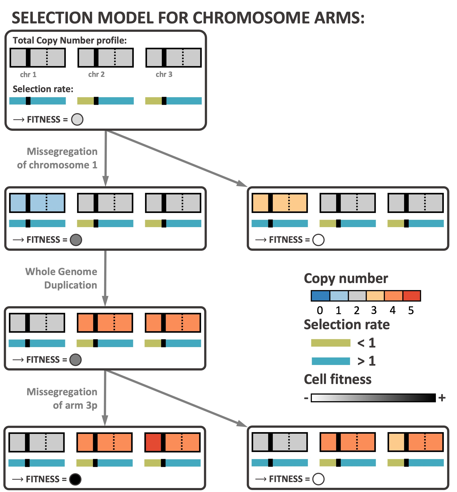
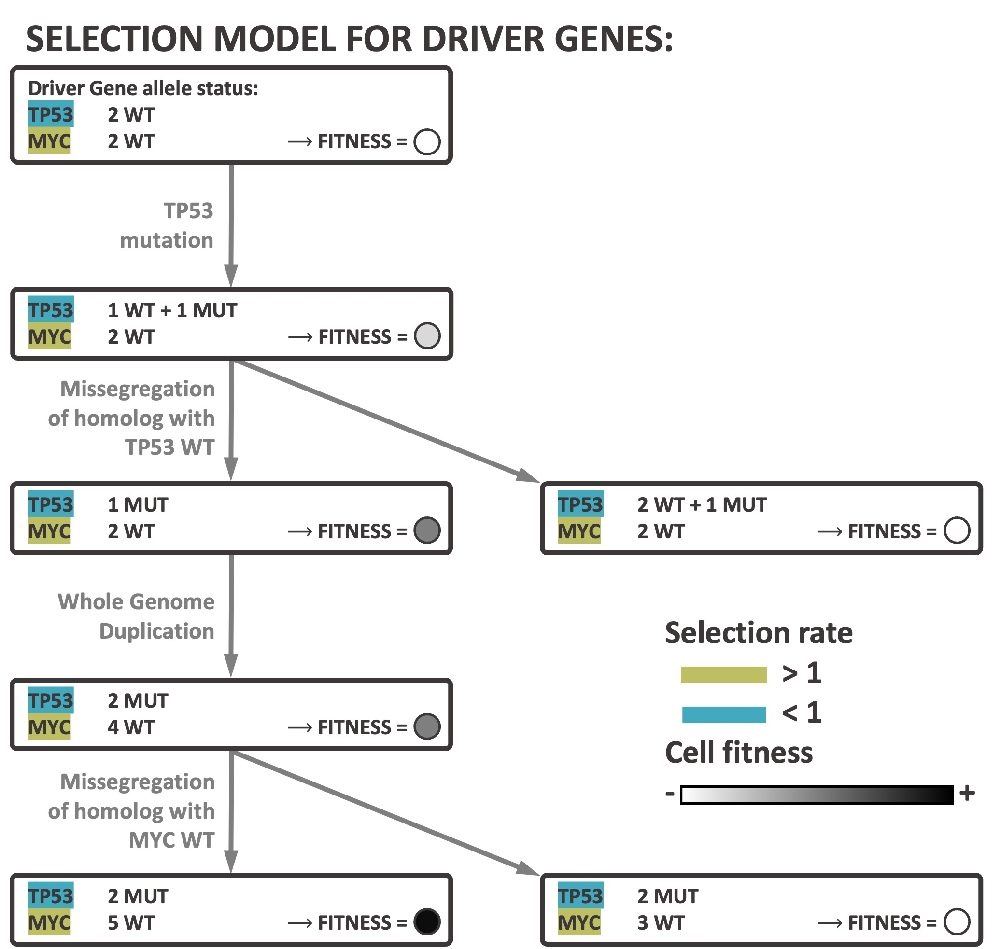

#   Simulation algorithm for chromosomal instability during cancer development

##  Installation

CINner [1] (read preprint on [bioRxiv](https://www.biorxiv.org/content/10.1101/2024.04.03.587939v1))
is an algorithm to simulate cancer evolution driven by the occurrence and selection of mutations and Copy Number Aberrations (CNAs).
It is designed to reproduce data from single-cell DNA sequencing, such as [Direct Library Preparation+ (DLP+)](https://www.cell.com/cell/fulltext/S0092-8674(19)31176-6).

The CINner library can be installed with

```R
devtools::install_github("dinhngockhanh/CINner")
```

Detailed descriptions of how to run CINner and its capabilities can be viewed in the [introductory vignette](https://dinhngockhanh.github.io/CINner/CINner.html).

##  Mathematical model

In CINner, each cell is characterized by its copy number (CN) profile, or driver single nucleotide variant (SNV) profile, or both.
As genomic regions are amplified or deleted as copy number aberrations (CNAs) occur, the SNVs residing in those regions are correspondingly multiplied or lost.
CINner models cancer evolution as a branching process.
Cell lifespan is exponentially distributed with an input turnover rate.
At the end of its lifespan, the cell either divides or dies.
The probability for a cell to divide depends on its fitness, determined by its CN and mutation profiles according to a selection model.
The division probability is also calibrated so that the population size follows established dynamics.
After a cell division, daughter cells either have the same profiles as the mother cell, or harbor CNA or driver SNVs events resulting in new profiles.


CINner can accommodate five distinct CNA mechanisms, each with distinct alteration patterns and varying impacts on cell fitness.
These events occur during a cell division with probabilities defined by the user.
Each chromosome homolog is represented as a vector, where each entry is the CN in a bin (vertical solid lines represent centrosomes, separating the two chromosome arms).
Whole Genome Duplication results in one progeny with two copies of each homolog in the parent cell’s genome.
Other events are chromosome specific.
During a whole-chromosome missegregation, one random homolog is misplaced between the two progeny cells.
During a chromosome-arm missegregation, a homolog is torn between the progeny, with one cell gaining a random arm and the other cell losing that arm.
Focal amplification and deletion target a random region on a random chromosome arm, and either doubles the CN across all bins in that region (amplification, yellow bins) or resets the CN with 0 (deletion, blue bins).
Driver mutation does not affect the CN profiles, but one allele of a randomly selected driver gene is changed from wild-type to mutant in a cell (lightning symbol). 


##  Selection models

Three selection models are included in CINner.
The first model characterizes the selection of chromosome arms, with the following assumptions:

- For chromosome arms with selection parameter s > 1: gains increase the cell fitness and losses decrease fitness.
This change increases with higher s.

- For arms with s < 1: losses increase fitness and gains decrease fitness.
The impact increases with higher 1/s.

The selection parameter serves as an indicator for the balance of tumor suppressor genes (TSGs) and oncogenes (OGs), as arms with high OG counts are commonly amplified and arms with many TSGs frequently get lost in cancer.



The model for selection of driver mutations seeks to portray the selection of individual TSGs and OGs directly.
In this model, the selection parameters for the wild-type (WT) and mutant (MUT) alleles of a gene, are defined according to whether the gene functions as a TSG or an OG in that specific cancer type.
We assume that a cell’s fitness increases when

- a TSG is mutated or lost, or

- an OG is mutated or gained.

This model is based on the “one-hit” hypothesis, where each additional driver gene hit renders the cell more advantageous.



The third selection model in CINner is a combination of these two models, describing cancer as driven both by small events targeting driver genes and large CNAs changing gene balance across the genome.

##  Output from CINner

CINner is developed to efficiently simulate observed SNVs and CNAs in a tumor sample.
To optimize for computing memory and runtime, the genome is divided into bins of a fixed size, and the allele-specific bin-level copy number profile of each cell is tracked throughout tumor progression.
Each new mutation is assigned a genomic location, and gets multiplied or deleted if the site is affected by later CNAs.
Two observations are utilized to increase the efficiency of CINner:

- Cells with the same phylogenetic origin share the same CN and mutational profiles, therefore they evolve similarly throughout time.

- The information relevant for downstream analysis is restricted to only the sampled cells.

As a result, it is not necessary to simulate single cells in the whole population individually, and instead we focus on clones, defined as groups of cells that have identical CN and mutational characteristics.

The first step of CINner consists of simulating the evolution of clones in forward time. 
New clones are generated when CNAs or driver mutations occur, and the clone sizes change through time according to the branching process governing cell division and death.
We use the tau-leaping algorithm for efficiency, as the exact Gillespie algorithm is time-consuming for cell populations of the typical size of tumors.
In the second step, CINner samples cells from predefined time points.
Next, it constructs the phylogeny for the sampled cells by using the “down-up-down” simulation technique.
In short, the sampled cell phylogeny is generated as a coalescent, informed by the recorded clone-specific cell division counts throughout time from step 1.
Finally, cell-to-cell variations due to neutral CNAs and passenger mutations are simulated on top of the phylogeny tree and trickle down to the sample observations.
CINner can complete prematurely if the later steps are not necessary, depending on the data requested by the user.


The use of the “down-up-down” strategy and tau-leaping algorithm allows for significantly reduced runtime of CINner, compared to directly simulating the branching process for the whole population and then extracting the phylogeny only for the sampled cells.
The runtime of simulating the clonal evolution (step 1) scales with the number of clones and the number of time steps.
The clone count increases with higher CNA and driver mutation probabilities.
The number of time steps increases inversely with the step size selected for the tau-leaping algorithm.
Meanwhile, the computational cost of simulating the phylogeny (step 3) scales with the number of sampled cells, which is typically of magnitudes smaller than the population size.

We note that the data simulated in the forward and backward steps capture complementary views of cancer evolution.
Step 1 in CINner simulates the whole population throughout time.
The population at each time point is characterized by distinct co-existing clones, their CN and driver mutation profiles, and their cell counts.
This information contains all clones that arise during the whole process, including those that become extinct or are rare at the final time and hence unrepresented in the sample taken in step 2.
Therefore, the output data allows for the examination of the expansion and/or extinction of any given clone in the simulation.
On the other hand, the sample phylogeny from step 3 in CINner captures the history of a subsample of cells taken at the final time point.
It therefore represents information that is observable from a hypothetical tumor biopsy. 
The phylogeny depicts recent subclonal evolution, but may lack (a) a full view of the heterogeneity in the whole cell population, and (b) information about early population genetic processes, e.g. before the sample MRCA.
Depending on the applications, the users may utilize the data from either step for their analyses.

##  References

1.  Dinh KN, Vázquez-García I, Chan A, Malhotra R, Weiner A, McPherson AW, Tavaré S.
CINner: modeling and simulation of chromosomal instability in cancer at single-cell resolution.
bioRxiv. 2024 Apr 3.