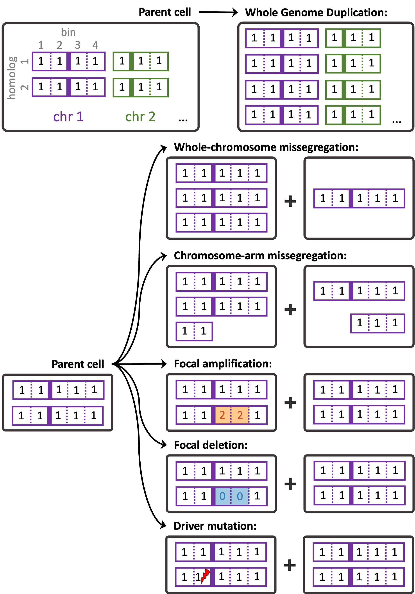

#   Simulation algorithm for chromosomal instability during cancer development

##  Installation

CINner [1] (read preprint on [bioRxiv](https://www.biorxiv.org/content/10.1101/2024.04.03.587939v1))
is an algorithm to simulate cancer evolution driven by the occurrence and selection of mutations and Copy Number Aberrations (CNAs).
It is designed to reproduce data from single-cell DNA sequencing, such as [Direct Library Preparation+ (DLP+)](https://www.cell.com/cell/fulltext/S0092-8674(19)31176-6).

The CINner library can be installed with

```R
devtools::install_github("dinhngockhanh/CINner")
```

Detailed descriptions of how to run CINner and its capabilities can be viewed in the [introductory vignette](https://dinhngockhanh.github.io/CINner/CINner.html).

##  CINner's mathematical model

In CINner, each cell is characterized by its copy number (CN) profile, or driver single nucleotide variant (SNV) profile, or both.
As genomic regions are amplified or deleted as copy number aberrations (CNAs) occur, the SNVs residing in those regions are correspondingly multiplied or lost.
CINner models cancer evolution as a branching process.
Cell lifespan is exponentially distributed with an input turnover rate.
At the end of its lifespan, the cell either divides or dies.
The probability for a cell to divide depends on its fitness, determined by its CN and mutation profiles according to a selection model.
The division probability is also calibrated so that the population size follows established dynamics.
After a cell division, daughter cells either have the same profiles as the mother cell, or harbor CNA or driver SNVs events resulting in new profiles.


CINner can accommodate five distinct CNA mechanisms, each with distinct alteration patterns and varying impacts on cell fitness.
These events occur during a cell division with probabilities defined by the user.
Each chromosome homolog is represented as a vector, where each entry is the CN in a bin (vertical solid lines represent centrosomes, separating the two chromosome arms).
Whole Genome Duplication results in one progeny with two copies of each homolog in the parent cell’s genome.
Other events are chromosome specific.
During a whole-chromosome missegregation, one random homolog is misplaced between the two progeny cells.
During a chromosome-arm missegregation, a homolog is torn between the progeny, with one cell gaining a random arm and the other cell losing that arm.
Focal amplification and deletion target a random region on a random chromosome arm, and either doubles the CN across all bins in that region (amplification, yellow bins) or resets the CN with 0 (deletion, blue bins).
Driver mutation does not affect the CN profiles, but one allele of a randomly selected driver gene is changed from wild-type to mutant in a cell (lightning symbol). 



Three selection models are included.
The first model characterizes the selection of chromosome arms (left on the figure below), with the following assumptions:

    - For chromosome arms with selection parameter s>1: gains increase the cell fitness and losses decrease fitness. This change increases with higher s.

    - For arms with s<1: losses increase fitness and gains decrease fitness. The impact increases with higher 1/s.
    
The selection parameter serves as an indicator for the balance of tumor suppressor genes (TSGs) and oncogenes (OGs), as arms with high OG counts are commonly amplified and arms with many TSGs frequently get lost in cancer


##  References

1.  Dinh KN, Vázquez-García I, Chan A, Malhotra R, Weiner A, McPherson AW, Tavaré S.
CINner: modeling and simulation of chromosomal instability in cancer at single-cell resolution.
bioRxiv. 2024 Apr 3.